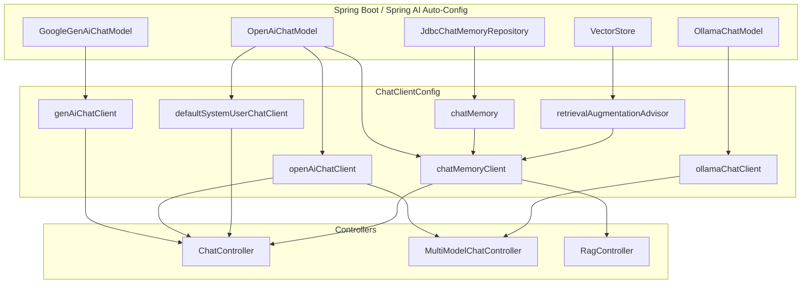
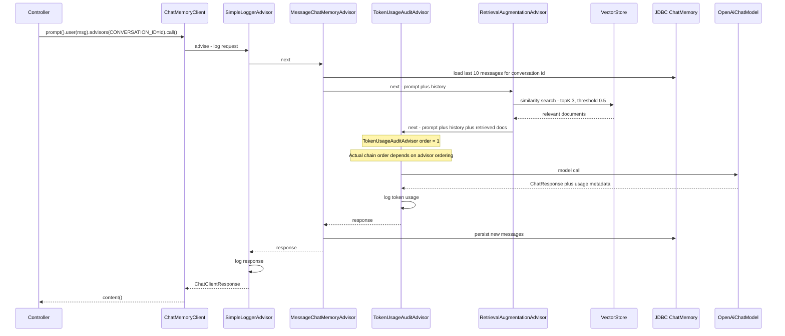
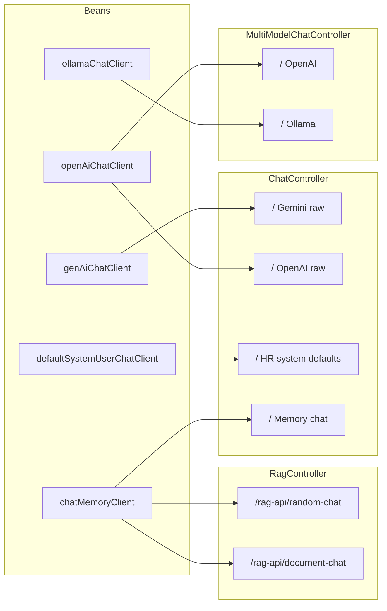

# ChatClientConfig — Class, Bean Flow & Design

**Source:** `src/main/java/com/smartshop/customer/springbootai/config/ChatClientConfig.java`  
**Type:** Spring `@Configuration`  
**Role:** Central factory for all `ChatClient` beans, conversation memory, and automatic RAG retrieval used by this application.

---

## 1. Class Overview

`ChatClientConfig` wires multiple Spring AI chat clients against different model backends (Google Gemini, OpenAI, Ollama) and attaches **advisors** that add logging, system guardrails, conversation memory, token auditing, and RAG.

| Concern | How this class handles it |
|---|---|
| Multi-model support | Separate beans per provider (`GoogleGenAiChatModel`, `OpenAiChatModel`, `OllamaChatModel`) |
| Client construction styles | Direct `ChatClient.create(model)` vs `ChatClient.builder(model)...build()` |
| Cross-cutting behavior | Advisors registered as **default advisors** on the builder |
| Stateful chat | `ChatMemory` + `MessageChatMemoryAdvisor` + runtime `CONVERSATION_ID` |
| RAG | `RetrievalAugmentationAdvisor` + `VectorStoreDocumentRetriever` |
| Persistence | JDBC-backed `MessageWindowChatMemory` (max 10 messages) |

---

## 2. Beans Produced by This Class

| Bean method | Spring bean name | Return type | Model / deps | Purpose |
|---|---|---|---|---|
| `genAiChatClient` | `genAiChatClient` | `ChatClient` | `GoogleGenAiChatModel` | Vanilla Gemini client |
| `openAiChatClient` | `openAiChatClient` | `ChatClient` | `OpenAiChatModel` | Vanilla OpenAI client |
| `ollamaChatClient` | `ollamaChatClient` | `ChatClient` | `OllamaChatModel` + logger | Local Ollama client with logging |
| `defaultSystemUserChatClient` | `defaultSystemUserChatClient` | `ChatClient` | `OpenAiChatModel` + options + HR system prompt | Opinionated HR assistant |
| `chatMemoryClient` | `chatMemoryClient` | `ChatClient` | OpenAI + memory + RAG + audit + logger | Stateful RAG chat |
| `chatMemory` | `chatMemory` | `ChatMemory` | `JdbcChatMemoryRepository` | Sliding-window conversation store |
| `retrievalAugmentationAdvisor` | `retrievalAugmentationAdvisor` | `RetrievalAugmentationAdvisor` | `VectorStore` | Auto document retrieval for RAG |

> **Note:** There are multiple `ChatClient` beans of the same type. Controllers disambiguate them with `@Qualifier("beanName")`.

---

## 3. External Dependencies (Injected, Not Defined Here)

These are provided by Spring Boot auto-configuration / other config, then injected into this class:

```
GoogleGenAiChatModel     ← Spring AI Google GenAI starter
OpenAiChatModel          ← Spring AI OpenAI starter
OllamaChatModel          ← Spring AI Ollama starter
JdbcChatMemoryRepository ← Spring AI JDBC chat-memory auto-config
VectorStore              ← e.g. Qdrant / other vector-store starter
```

---

## 4. High-Level Bean Dependency Graph



---

## 5. Construction Patterns

### 5.1 Direct create (minimal / vanilla)

Used by `genAiChatClient` and `openAiChatClient`:

```java
ChatClient.create(model);
```

- No default advisors
- No default system/user prompts
- No default options
- Ideal for raw model behavior and multi-model comparisons

### 5.2 Builder (opinionated / production)

Used by `ollamaChatClient`, `defaultSystemUserChatClient`, and `chatMemoryClient`:

```java
ChatClient.builder(model)
    .defaultOptions(...)
    .defaultAdvisors(...)
    .defaultSystem("...")
    .build();
```

- Defaults apply to **every** prompt unless overridden at call time
- Advisors form a pipeline around each request/response

### 5.3 Commented alternative (auto-config builder)

```java
// ChatClient.Builder chatClientBuilder  // Spring Boot injects pre-wired builder
// return chatClientBuilder.defaultOptions(...).build();
```

This would reuse Spring’s auto-configured builder (defaults, metrics, etc.) instead of binding to a specific model explicitly.

---

## 6. Per-Bean Design & Flow

### 6.1 `genAiChatClient`

```
GoogleGenAiChatModel ──► ChatClient.create(model) ──► genAiChatClient
                                                      └── used by ChatController
```

| Aspect | Detail |
|---|---|
| Style | Direct create |
| Advisors | None |
| System prompt | None |
| Use case | General Gemini chat without app-level constraints |

---

### 6.2 `openAiChatClient`

```
OpenAiChatModel ──► ChatClient.create(model) ──► openAiChatClient
                                                 ├── ChatController
                                                 └── MultiModelChatController
```

| Aspect | Detail |
|---|---|
| Style | Direct create |
| Advisors | None |
| Use case | Baseline OpenAI calls; multi-model A/B vs Ollama |

---

### 6.3 `ollamaChatClient`

```
OllamaChatModel
      │
      ▼
ChatClient.builder(model)
  .defaultAdvisors(SimpleLoggerAdvisor)
  .build()
      │
      ▼
ollamaChatClient ──► MultiModelChatController
```

| Aspect | Detail |
|---|---|
| Style | Builder |
| Advisors | `SimpleLoggerAdvisor` (logs every request/response) |
| Use case | Local / self-hosted models with traffic visibility |

---

### 6.4 `defaultSystemUserChatClient` (HR assistant)

```
OpenAiChatModel
      │
      ▼
OpenAiChatOptions
  model = gemma3
  temperature = 0.8
  maxCompletionTokens = 100
      │
      ▼
ChatClient.builder(model)
  .defaultOptions(options)
  .defaultAdvisors(SimpleLoggerAdvisor)
  .defaultSystem(HR guardrail prompt)
  .build()
      │
      ▼
defaultSystemUserChatClient ──► ChatController
```

**Default system prompt behavior:**

- Answers **only** HR topics (policies, benefits, leave, payroll, procedures)
- Non-HR questions get a fixed refusal string
- Prompt is a default; a per-call `.system(...)` would **override** it

| Setting | Value | Why |
|---|---|---|
| Model | `gemma3` | App-specific model choice via OpenAI-compatible options |
| Temperature | `0.8` | Moderate creativity |
| Max tokens | `100` | Short, controlled answers |
| Logger | always on | Observability without per-endpoint setup |

---

### 6.5 `chatMemory` (conversation store)

```
JdbcChatMemoryRepository  (auto-config, SQL DB)
            │
            ▼
MessageWindowChatMemory.builder()
  .maxMessages(10)
  .chatMemoryRepository(jdbc...)
  .build()
            │
            ▼
        chatMemory bean
            │
            └── injected into chatMemoryClient
```

| Setting | Value | Effect |
|---|---|---|
| Window size | 10 messages | Only last 10 turns kept in prompt context |
| Storage | JDBC | Survives restarts; shareable across instances |
| Isolation | `CONVERSATION_ID` param at runtime | Per-user / per-session history |

**Why a sliding window?**

- Bounds token usage and cost
- Prevents unbounded prompt growth on long chats
- Keeps latency more predictable

---

### 6.6 `retrievalAugmentationAdvisor` (automatic RAG)

```
VectorStore  (e.g. Qdrant)
      │
      ▼
VectorStoreDocumentRetriever
  topK = 3
  similarityThreshold = 0.5
      │
      ▼
RetrievalAugmentationAdvisor
      │
      └── injected into chatMemoryClient as default advisor
```

| Setting | Value | Meaning |
|---|---|---|
| `topK` | `3` | At most 3 nearest documents |
| `similarityThreshold` | `0.5` | Drop results below 50% similarity |

**Design intent:** Controllers no longer need manual `vectorStore.similaritySearch(...)`. The advisor runs retrieval **before** the model call and injects context into the prompt.

---

### 6.7 `chatMemoryClient` (full stack: memory + RAG + audit)

This is the richest bean in the config.

```
OpenAiChatModel
ChatMemory ─────────────────┐
RetrievalAugmentationAdvisor┤
                            ▼
ChatClient.builder(model)
  .defaultAdvisors(
      SimpleLoggerAdvisor,           // log I/O
      MessageChatMemoryAdvisor,      // load/save history
      TokenUsageAuditAdvisor,        // log token usage
      RetrievalAugmentationAdvisor   // auto RAG
  )
  .build()
      │
      ▼
chatMemoryClient
  ├── ChatController  (conversation endpoints)
  └── RagController   (RAG endpoints; CONVERSATION_ID = username)
```

#### Runtime request flow (one user turn)



> Advisors form a chain. Exact interleaving depends on each advisor’s `getOrder()` and registration order. `TokenUsageAuditAdvisor` uses `getOrder() = 1` and audits **after** the model returns (it calls `nextCall` first, then reads `Usage` from metadata).

#### Advisor responsibilities

| Advisor | When it runs | What it does |
|---|---|---|
| `SimpleLoggerAdvisor` | Every exchange | Logs request/response |
| `MessageChatMemoryAdvisor` | Before + after model | Loads history by `CONVERSATION_ID`; saves new turns |
| `TokenUsageAuditAdvisor` | After model | Logs prompt/completion token usage |
| `RetrievalAugmentationAdvisor` | Before model | Vector search + injects docs into prompt |

#### Runtime parameter required for memory

Call sites must supply conversation isolation:

```java
.advisors(a -> a.param(ChatMemory.CONVERSATION_ID, username))
// or
.advisors(a -> a.param(ChatMemory.CONVERSATION_ID, "default"))
```

Without a stable ID, memory cannot correctly scope multi-turn history.

---

## 7. Consumer Map (Who Uses What)



| Controller | Injected clients (`@Qualifier`) |
|---|---|
| `ChatController` | `genAiChatClient`, `openAiChatClient`, `defaultSystemUserChatClient`, `chatMemoryClient` |
| `MultiModelChatController` | `openAiChatClient`, `ollamaChatClient` |
| `RagController` | `chatMemoryClient` (+ `VectorStore` for any remaining direct use) |

---

## 8. Design Rationale Summary

### Progressive complexity ladder

The config intentionally exposes clients from simple → advanced:

1. **Vanilla** (`genAi` / `openAi`) — learn raw `ChatClient`
2. **Logged** (`ollama`) — add one advisor
3. **Guarded** (`defaultSystemUser`) — defaults + system prompt + options
4. **Stateful RAG** (`chatMemoryClient`) — memory + retrieval + audit pipeline

### Why multiple ChatClient beans instead of one?

| Benefit | Explanation |
|---|---|
| Isolation | HR guardrails do not leak into multi-model demos |
| Qualifier clarity | Controllers pick intent by bean name |
| Different models | Gemini vs OpenAI vs Ollama without runtime branching |
| Different advisor stacks | Memory/RAG only where needed |

### Defaults vs call-time overrides

- **Defaults** on the builder apply to every call automatically.
- Controllers can still override `.system(...)`, `.user(...)`, options, or add extra advisors per request.
- Memory isolation is **always** call-time via `CONVERSATION_ID`.

### Separation of infrastructure beans

`chatMemory` and `retrievalAugmentationAdvisor` are standalone beans so they can be:

- Reused by other clients later
- Tested independently
- Replaced (e.g. different retriever or memory window) without rewriting client construction

---

## 9. Quick Reference — Bean Wiring Cheat Sheet

```
ChatClientConfig
├── genAiChatClient(GoogleGenAiChatModel)
│     └── ChatClient.create(model)
│
├── openAiChatClient(OpenAiChatModel)
│     └── ChatClient.create(model)
│
├── ollamaChatClient(OllamaChatModel)
│     └── builder + SimpleLoggerAdvisor
│
├── defaultSystemUserChatClient(OpenAiChatModel)
│     └── builder + options(gemma3, 0.8, 100)
│         + SimpleLoggerAdvisor
│         + defaultSystem(HR only)
│
├── chatMemory(JdbcChatMemoryRepository)
│     └── MessageWindowChatMemory(maxMessages=10)
│
├── retrievalAugmentationAdvisor(VectorStore)
│     └── VectorStoreDocumentRetriever(topK=3, threshold=0.5)
│
└── chatMemoryClient(OpenAiChatModel, ChatMemory, RetrievalAugmentationAdvisor)
      └── builder + advisors:
            SimpleLoggerAdvisor
            MessageChatMemoryAdvisor(chatMemory)
            TokenUsageAuditAdvisor
            retrievalAugmentationAdvisor
```

---

## 10. Related Files

| File | Relation |
|---|---|
| `advisors/TokenUsageAuditAdvisor.java` | Custom advisor used by `chatMemoryClient` |
| `controller/ChatController.java` | Primary consumer of most clients |
| `controller/MultiModelChatController.java` | OpenAI vs Ollama comparison |
| `controller/RagController.java` | RAG endpoints using `chatMemoryClient` |
| `rag/HRPolicyLoader.java` / `RandomDataLoader.java` | Populate `VectorStore` used by RAG advisor |
| `config/WebSearchRagClientConfig.java` | Separate web-search RAG client (outside this class) |
