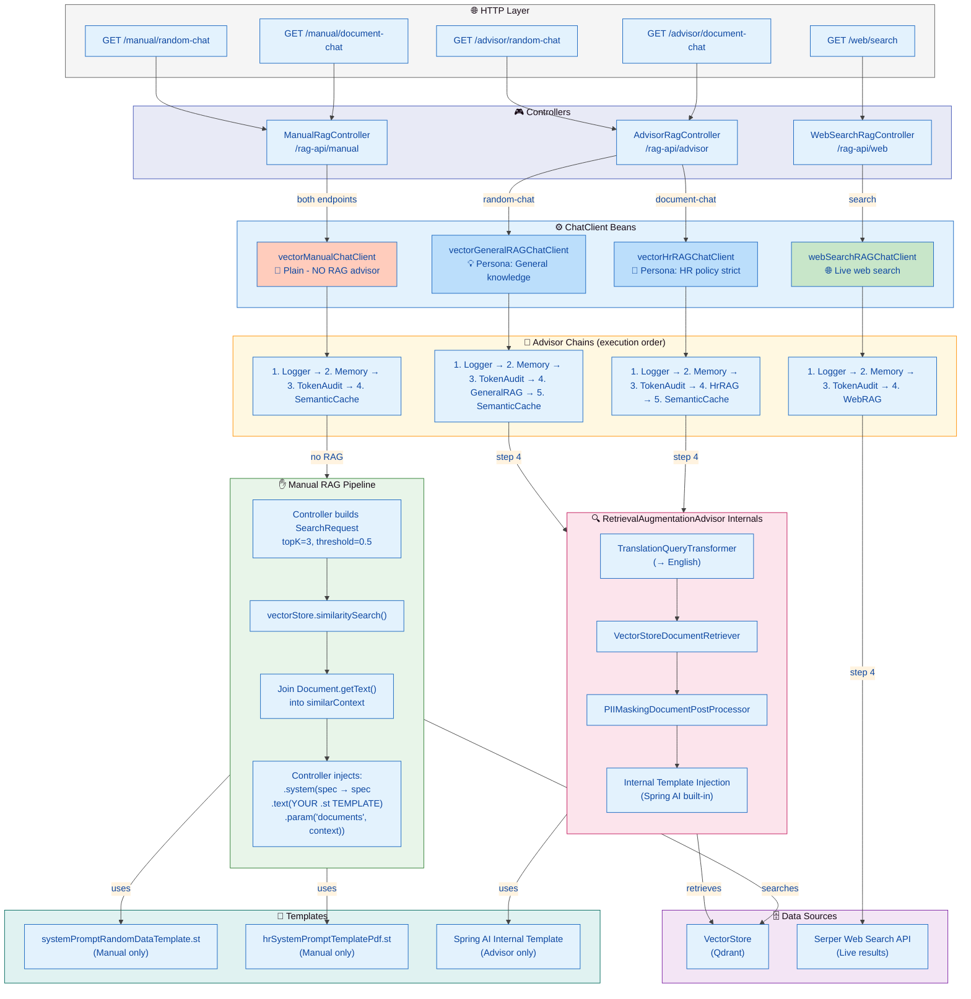

# RAG Architecture — Split by Mechanism

This document explains the refactored RAG architecture where controllers are split by **mechanism** (Advisor vs Manual vs Web) and the advisor paths are **truly different** (separate ChatClient beans, separate retrieval configs, separate personas).

---

## 1. Controller Split by Mechanism

| Controller | Base Path | Purpose |
|------------|-----------|---------|
| `AdvisorRagController` | `/rag-api/advisor` | Automatic RAG via `RetrievalAugmentationAdvisor`. Two distinct clients: General and HR. |
| `ManualRagController` | `/rag-api/manual` | Explicit `VectorStore` search + `.system()` template injection. Reference/escape-hatch implementation. |
| `WebSearchRagController` | `/rag-api/web` | Live web search via `SerperWebDocumentRetriever`. |

---

## 2. Endpoints

### 2.1 Advisor-based Vector RAG (`AdvisorRagController`)

| Endpoint | Bean Used | Retrieval Config | Persona | Template Source |
|----------|-----------|------------------|---------|-----------------|
| `GET /rag-api/advisor/random-chat` | `vectorGeneralRAGChatClient` | topK=3, similarityThreshold=0.5 | General knowledge | `defaultSystem()` inline |
| `GET /rag-api/advisor/document-chat` | `vectorHrRAGChatClient` | topK=5, similarityThreshold=0.7 | HR policy strict | `defaultSystem()` inline |

**Flow:**
1. Controller receives `username` (header) and `message` (query param).
2. Controller sets `CONVERSATION_ID` for chat memory isolation.
3. Controller passes `.user(message)`.
4. `RetrievalAugmentationAdvisor` intercepts:
   - Translates query to English (if needed).
   - Searches `VectorStore` with the config bound to that bean.
   - Masks PII via `PIIMaskingDocumentPostProcessor`.
   - Injects retrieved documents using its **internal template**.
5. AI model receives the enriched prompt.

**Key:** The controller does **not** pass `systemPromptRandomDataTemplate.st` or `hrSystemPromptTemplatePdf.st`. The advisor handles system prompt composition.

---

### 2.2 Manual Vector RAG (`ManualRagController`)

| Endpoint | Bean Used | Retrieval | Template Source |
|----------|-----------|-----------|-----------------|
| `GET /rag-api/manual/random-chat` | `vectorManualChatClient` (plain, **no RAG advisor**) | Controller builds `SearchRequest` | `systemPromptRandomDataTemplate.st` |
| `GET /rag-api/manual/document-chat` | `vectorManualChatClient` (plain, **no RAG advisor**) | Controller builds `SearchRequest` | `hrSystemPromptTemplatePdf.st` |

**Flow:**
1. Controller receives `username` and `message`.
2. Controller builds `SearchRequest` (topK=3, threshold=0.5).
3. Controller calls `vectorStore.similaritySearch(searchRequest)`.
4. Controller joins `Document.getText()` into `similarContext`.
5. Controller injects into **its own template**:
   ```java
   .system(spec -> spec
       .text(systemPromptTemplate)
       .param("documents", similarContext))
   ```
6. Controller sets `CONVERSATION_ID` and calls the model.

**Critical:** `vectorManualChatClient` intentionally has **no** `RetrievalAugmentationAdvisor`. If it did, the advisor would perform a **second** retrieval and inject a **second** copy of documents, causing double context and conflicting formats.

---

### 2.3 Web-search RAG (`WebSearchRagController`)

| Endpoint | Bean Used | Data Source | Max Results |
|----------|-----------|-------------|-------------|
| `GET /rag-api/web/search` | `webSearchRAGChatClient` | Serper Web Search API | 5 |

**Flow:**
1. Controller receives `username` and `message`.
2. Controller sets `CONVERSATION_ID`.
3. Controller passes `.user(message)`.
4. `RetrievalAugmentationAdvisor` (wired to `SerperWebDocumentRetriever`) fetches live web results.
5. AI model receives web results as context.

---

## 3. ChatClient Beans

| Bean Name | Config Class | Default Advisors | Has RAG Advisor? | Purpose |
|-----------|--------------|------------------|------------------|---------|
| `vectorGeneralRAGChatClient` | `VectorSearchRagClientConfig` | Logger, Memory, TokenAudit, General RAG, SemanticCache | ✅ `generalRetrievalAdvisor` | Casual/general vector RAG |
| `vectorHrRAGChatClient` | `VectorSearchRagClientConfig` | Logger, Memory, TokenAudit, HR RAG, SemanticCache | ✅ `hrRetrievalAdvisor` | Strict HR policy vector RAG |
| `vectorManualChatClient` | `VectorSearchRagClientConfig` | Logger, Memory, TokenAudit, SemanticCache | ❌ **None** | Plain client for manual injection |
| `webSearchRAGChatClient` | `WebSearchRagClientConfig` | Logger, Memory, TokenAudit, Web RAG | ✅ Web RAG advisor | Live web search RAG |

---

## 4. Request Inputs and Where They Go

All endpoints accept:

- `username` (HTTP header)
    - Mapped to `ChatMemory.CONVERSATION_ID` via:
      ```java
      .advisors(a -> a.param(CONVERSATION_ID, username))
      ```
    - Effect: conversation history for that user is loaded and used for retrieval (memory replay happens before RAG in the advisor chain).

- `message` (query parameter)
    - Used as the user message: `.user(message)`.
    - Used as the retrieval query:
        - Manual: `SearchRequest.builder().query(message)`.
        - Advisor: the `RetrievalAugmentationAdvisor` receives the prompt text.

---

## 5. How Manual Endpoints Inject `{documents}`

Both templates (`systemPromptRandomDataTemplate.st` and `hrSystemPromptTemplatePdf.st`) include a `{documents}` placeholder.

In `getStringManualRag(...)`:

1. Build vector search:
   ```java
   SearchRequest.builder()
       .query(message)
       .topK(3)
       .similarityThreshold(0.5)
   ```
2. Retrieve:
   ```java
   vectorStore.similaritySearch(searchRequest)
   ```
3. Join:
   ```java
   similarDocs.stream()
       .map(Document::getText)
       .collect(Collectors.joining(System.lineSeparator()))
   ```
4. Inject:
   ```java
   .system(spec -> spec
       .text(systemPromptTemplate)
       .param("documents", similarContext))
   ```

---

## 6. How Advisor Endpoints Differ

Advisor endpoints call:

```java
vectorGeneralRAGChatClient.prompt()
    .advisors(a -> a.param(CONVERSATION_ID, username))
    .user(message)
    .call()
    .content();
```

The config adds:

- `SimpleLoggerAdvisor` — request/response logging.
- `MessageChatMemoryAdvisor` — JDBC-backed sliding window (10 messages).
- `TokenUsageAuditAdvisor` — token consumption logging.
- `RetrievalAugmentationAdvisor` (General or HR) — automatic retrieval + injection.
- `SemanticCacheAdvisor` — Redis-backed semantic caching.

Advisor execution order:
`Logger → Memory → TokenAudit → RetrievalAugmentationAdvisor → SemanticCache`.

The advisor:

1. Intercepts the prompt.
2. Runs query translation (to English).
3. Retrieves via `VectorStoreDocumentRetriever` (config-specific topK/threshold).
4. Applies `PIIMaskingDocumentPostProcessor`.
5. Injects documents using its **internal template** (not the controller's `.st` files).

---

## 7. Web-search vs Vector RAG

| Aspect | Vector RAG | Web-search RAG |
|--------|-----------|----------------|
| Data source | Local `VectorStore` (Qdrant) | Serper Web Search API |
| Freshness | Static (last ingested) | Live |
| Retriever | `VectorStoreDocumentRetriever` | `SerperWebDocumentRetriever` |
| Max results | 3 (General) / 5 (HR) | 5 |
| Similarity threshold | 0.5 (General) / 0.7 (HR) | N/A (ranked search) |

---

## 8. Differences Summary

### 8.1 Manual vs Advisor

| Feature | Manual (`/manual/*`) | Advisor (`/advisor/*`) |
|---------|----------------------|------------------------|
| Who retrieves? | Controller | `RetrievalAugmentationAdvisor` |
| Who joins docs? | Controller | Advisor |
| Who injects? | Controller via `.system(...)` | Advisor via internal template |
| Template control | Full (your `.st` files) | Limited (advisor internal) |
| PII masking | ❌ Not applied | ✅ `PIIMaskingDocumentPostProcessor` |
| Query translation | ❌ Not applied | ✅ `TranslationQueryTransformer` |
| Semantic cache | ✅ Via `vectorManualChatClient` | ✅ Via advisor client |
| Double-fetch risk | ❌ None (plain client) | ❌ None (separate beans) |

### 8.2 General vs HR Advisor

| Feature | General (`/advisor/random-chat`) | HR (`/advisor/document-chat`) |
|---------|----------------------------------|-------------------------------|
| Bean | `vectorGeneralRAGChatClient` | `vectorHrRAGChatClient` |
| topK | 3 | 5 |
| similarityThreshold | 0.5 | 0.7 |
| Persona | General knowledge | Strict HR policy |
| Use case | Random facts, open domain | Policy questions, compliance |

---

## 9. Where to Look

- `AdvisorRagController` — `/rag-api/advisor/*`
- `ManualRagController` — `/rag-api/manual/*`
- `WebSearchRagController` — `/rag-api/web/*`
- `VectorSearchRagClientConfig` — General, HR, and Manual ChatClient beans
- `WebSearchRagClientConfig` — Web search ChatClient bean
- `PIIMaskingDocumentPostProcessor` — PII redaction in retrieved docs
- `TokenUsageAuditAdvisor` — Token usage logging
- `promtTemplates/systemPromptRandomDataTemplate.st` — Manual random-data template
- `promtTemplates/hrSystemPromptTemplatePdf.st` — Manual HR template

---

## 10. Usage Guidance

Use `/rag-api/advisor/random-chat` when you want:
- Automatic retrieval and injection.
- General-knowledge answers with relaxed similarity (0.5).

Use `/rag-api/advisor/document-chat` when you want:
- Automatic retrieval and injection.
- HR-specific answers with strict similarity (0.7).
- Higher confidence matches (fewer, better docs).

Use `/rag-api/manual/*` when you want:
- Full control over `SearchRequest` construction.
- Deterministic prompt wiring via your own `.st` templates.
- To bypass or customize PII masking / query translation.
- To debug/compare against the advisor path.

Use `/rag-api/web/search` when:
- The answer requires live, up-to-date information.
- The vector store is stale or missing the topic.
- You want the same advisor pattern but with web results.


Here is a comprehensive **Mermaid** flowchart showing the full split-by-mechanism architecture.



---

## Key Visual Differences

| Path | Color | Client | Who Owns Retrieval? | Template Source |
|------|-------|--------|---------------------|-----------------|
| **General Advisor** | 🔵 Blue | `vectorGeneralRAGChatClient` | `RetrievalAugmentationAdvisor` | Spring AI internal |
| **HR Advisor** | 🔵 Blue | `vectorHrRAGChatClient` | `RetrievalAugmentationAdvisor` | Spring AI internal |
| **Manual** | 🟠 Orange | `vectorManualChatClient` | **Controller** | Your `.st` files |
| **Web Search** | 🟢 Green | `webSearchRAGChatClient` | `RetrievalAugmentationAdvisor` | Spring AI internal |

---

## Critical Path Highlighted

```
Manual Controller ──► vectorManualChatClient ──► NO RAG advisor ──► Controller does everything
                                                                          │
                                    ┌─────────────────────────────────────┘
                                    ▼
                           ┌─────────────────┐
                           │  YOUR template  │
                           │  + YOUR docs    │
                           │  injected by YOU│
                           └─────────────────┘
```

If `vectorManualChatClient` accidentally had a `RetrievalAugmentationAdvisor`, the flow would look like this (bad):

```
Manual Controller ──► searches VectorStore ──► injects into .system()
       │
       ▼
   [RAG Advisor intercepts] ──► searches VectorStore AGAIN ──► injects again
       │
       ▼
   AI receives DOUBLE documents ❌
```

That is why `vectorManualChatClient` is **plain** (orange node in the diagram) — it breaks the chain before the RAG step.