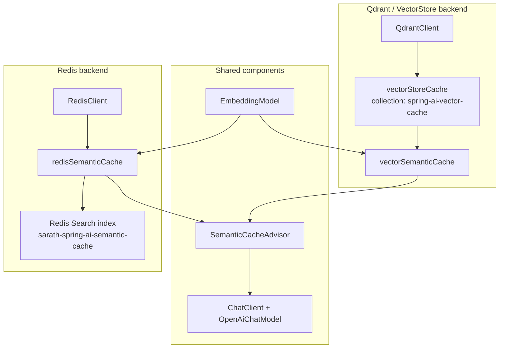
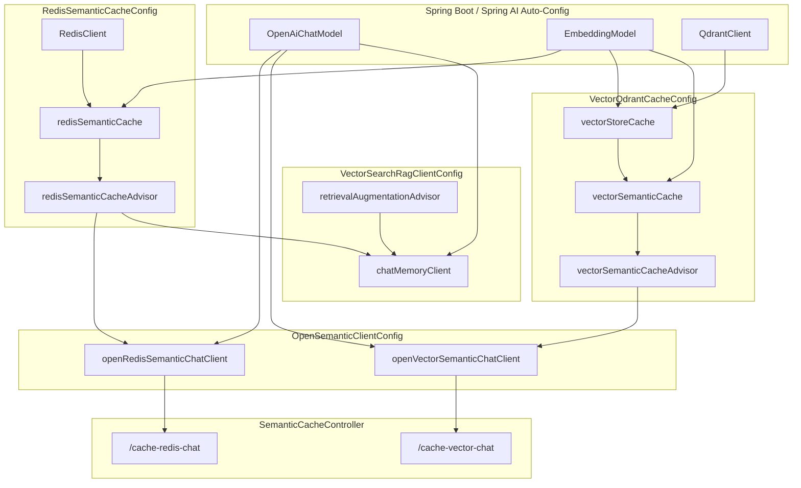
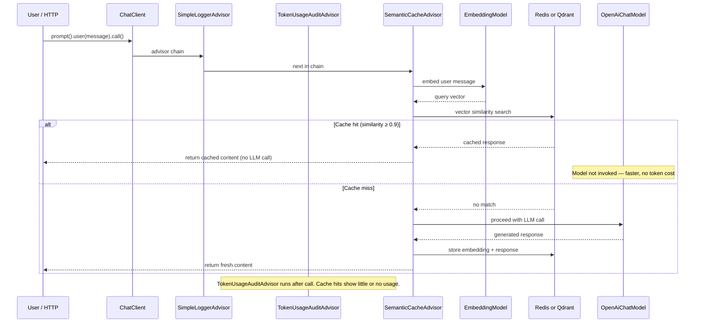
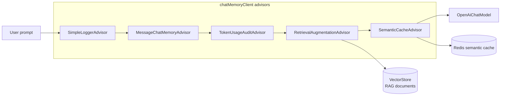

# Semantic Cache — Flow Design, Process & Benefits

Documents the **semantic caching** stack in this application: how it differs from exact-key caching, which classes participate, how requests flow through advisors, and why it helps reduce cost and latency.

**Related:** `ChatClientConfig.md` (RAG + memory on `chatMemoryClient`), `vectorStoreQdrant.md` (Qdrant vector store setup).

---

## 1. What Problem Does Semantic Cache Solve?

Traditional caches (Redis `GET`/`SET` by string key) only hit when the **exact same text** is requested again.

| Query A | Query B | Exact-key cache | Semantic cache |
|---|---|---|---|
| `What is Spring Boot?` | `What is Spring Boot?` | Hit | Hit |
| `Explain Spring Boot` | `What is Spring Boot?` | Miss | **Hit** (if similarity ≥ threshold) |
| `Tell me about Spring Boot framework` | `What is Spring Boot?` | Miss | **Hit** (if similarity ≥ threshold) |

Semantic caching stores **embeddings** of user prompts alongside the LLM response. On a new request, the prompt is embedded and compared (cosine similarity) against cached entries. If a sufficiently similar prior query exists, the cached response is returned **without calling the LLM**.

**Benefits:**

- **Lower cost** — fewer OpenAI (or other provider) API calls and tokens consumed
- **Lower latency** — cache lookup is faster than a full model round-trip
- **Better hit rate** — paraphrased or reworded questions still match
- **Composable** — works as a `ChatClient` advisor alongside logging, memory, RAG, and token auditing

---

## 2. Two Cache Backends in This App

This project implements the same Spring AI `SemanticCache` abstraction with **two different persistence layers**:



| Aspect | Redis (`RedisSemanticCacheConfig`) | Qdrant (`VectorQdrantCacheConfig`) |
|---|---|---|
| **Config class** | `config/cache/RedisSemanticCacheConfig.java` | `config/cache/VectorQdrantCacheConfig.java` |
| **Storage** | Redis + Redis Search vector index | Qdrant via `QdrantVectorStore` |
| **Client bean** | `RedisClient` (Jedis) | `QdrantClient` (from Spring AI starter) |
| **Cache bean** | `redisSemanticCache` | `vectorSemanticCache` |
| **Advisor bean** | `redisSemanticCacheAdvisor` | `vectorSemanticCacheAdvisor` |
| **ChatClient bean** | `openRedisSemanticChatClient` | `openVectorSemanticChatClient` |
| **HTTP endpoint** | `GET /semantic-cache-api/cache-redis-chat` | `GET /semantic-cache-api/cache-vector-chat` |
| **Similarity threshold** | `0.9` | `0.9` |
| **Namespace** | index `sarath-spring-ai-semantic-cache`, prefix `cache: ` | collection `spring-ai-vector-cache` |

Both use `DefaultSemanticCache.builder()` from Spring AI; only the backing store differs (`.jedisClient(...)` vs `.vectorStore(...)`).

---

## 3. Classes & Bean Flow

### 3.1 Class map

| Class | Package | Role |
|---|---|---|
| `RedisSemanticCacheConfig` | `config/cache` | Redis client, Redis-backed `SemanticCache`, `SemanticCacheAdvisor` |
| `VectorQdrantCacheConfig` | `config/cache` | Qdrant `VectorStore` for cache, vector-backed `SemanticCache`, advisor |
| `OpenSemanticClientConfig` | `config/cache` | Two `ChatClient` beans wired with semantic cache advisors |
| `SemanticCacheController` | `controller` | REST API exposing Redis vs Qdrant cache paths |
| `VectorSearchRagClientConfig` | `config/rag` | RAG `chatMemoryClient` also includes `redisSemanticCacheAdvisor` |
| `TokenUsageAuditAdvisor` | `advisors` | Logs token usage — useful to **see cache hits** (zero or no usage on hit) |

### 3.2 Bean dependency graph



### 3.3 Beans produced

| Bean method | Bean name | Return type | Key dependencies |
|---|---|---|---|
| `redisClient` | `redisClient` | `RedisClient` | `spring.data.redis.host`, `spring.data.redis.port` |
| `redisSemanticCache` | `redisSemanticCache` | `SemanticCache` | `RedisClient`, `EmbeddingModel` |
| `redisSemanticCacheAdvisor` | `redisSemanticCacheAdvisor` | `SemanticCacheAdvisor` | `redisSemanticCache` |
| `vectorStoreCache` | `vectorStoreCache` | `VectorStore` | `QdrantClient`, `EmbeddingModel` |
| `vectorSemanticCache` | `vectorSemanticCache` | `SemanticCache` | `vectorStoreCache`, `EmbeddingModel` |
| `vectorSemanticCacheAdvisor` | `vectorSemanticCacheAdvisor` | `SemanticCacheAdvisor` | `vectorSemanticCache` |
| `openRedisSemanticChatClient` | `openRedisSemanticChatClient` | `ChatClient` | `OpenAiChatModel`, `redisSemanticCacheAdvisor` |
| `openVectorSemanticChatClient` | `openVectorSemanticChatClient` | `ChatClient` | `OpenAiChatModel`, `vectorSemanticCacheAdvisor` |

---

## 4. Request Flow (Semantic Cache Advisor)

When a user calls a cache-enabled `ChatClient`, `SemanticCacheAdvisor` intercepts the request **before** the model is invoked.



### 4.1 Step-by-step process

1. **User message arrives** — e.g. `GET /semantic-cache-api/cache-redis-chat?message=Explain+Spring+Boot`
2. **Advisor chain starts** — `OpenSemanticClientConfig` registers advisors in order:
   - `SimpleLoggerAdvisor` — logs request/response
   - `TokenUsageAuditAdvisor` — audits tokens after the call completes
   - `SemanticCacheAdvisor` — cache lookup / store logic
3. **Embedding** — `EmbeddingModel` converts the user text into a dense vector (same model family used elsewhere in the app, e.g. `mxbai-embed-large` via local Docker engine).
4. **Similarity search** — the vector is queried against stored cache-entry vectors:
   - **Redis:** Redis Search index `sarath-spring-ai-semantic-cache`
   - **Qdrant:** collection `spring-ai-vector-cache`
5. **Threshold check** — both configs use `similarityThreshold(0.9)`. Only matches with **≥ 90% cosine similarity** count as hits. This reduces false positives (unrelated questions returning wrong cached answers).
6. **Hit path** — cached LLM response text is returned immediately; OpenAI is not called.
7. **Miss path** — request continues to `OpenAiChatModel`; response is written back to the cache with its embedding for future lookups.

### 4.2 Redis-specific configuration

From `RedisSemanticCacheConfig`:

```java
DefaultSemanticCache.builder()
    .jedisClient(redisClient)
    .embeddingModel(embeddingModel)
    .similarityThreshold(0.9)
    .indexName("sarath-spring-ai-semantic-cache")
    .prefix("cache: ")
    .build();
```

| Setting | Value | Purpose |
|---|---|---|
| `similarityThreshold` | `0.9` | Strict matching — only very similar phrasing hits |
| `indexName` | `sarath-spring-ai-semantic-cache` | Redis Search vector index name |
| `prefix` | `cache: ` | Key namespace isolation in Redis |

Redis connection defaults: `localhost:6379` via `spring.data.redis.host` / `spring.data.redis.port`.

### 4.3 Qdrant-specific configuration

From `VectorQdrantCacheConfig`:

```java
QdrantVectorStore.builder(qdrantClient, embeddingModel)
    .collectionName("spring-ai-vector-cache")
    .initializeSchema(true)
    .build();
```

The cache reuses the Qdrant vector-store pattern already used for RAG, but in a **separate collection** (`spring-ai-vector-cache`) so cache entries do not mix with RAG document embeddings (`sarath-spring-ai`).

---

## 5. HTTP API (`SemanticCacheController`)

| Endpoint | ChatClient | Cache backend |
|---|---|---|
| `GET /semantic-cache-api/cache-redis-chat?message=...` | `openRedisSemanticChatClient` | Redis |
| `GET /semantic-cache-api/cache-vector-chat?message=...` | `openVectorSemanticChatClient` | Qdrant |

Both endpoints accept a single `message` query parameter and return the model (or cached) response as plain text.

**Example flow to observe caching:**

```http
GET /semantic-cache-api/cache-redis-chat?message=What%20is%20Spring%20Boot%3F
# First call → LLM invoked, response stored in cache

GET /semantic-cache-api/cache-redis-chat?message=Explain%20Spring%20Boot
# Second call (similar meaning) → likely cache hit if similarity ≥ 0.9
```

Check application logs for `TokenUsageAuditAdvisor` output — a cache hit typically avoids a full model call.

---

## 6. Integration with RAG (`VectorSearchRagClientConfig`)

Semantic caching is not limited to the dedicated cache demo endpoints. The RAG-enabled **`chatMemoryClient`** also registers `redisSemanticCacheAdvisor`:

```java
ChatClient.builder(model)
    .defaultAdvisors(
        loggerAdvisor,
        memoryAdvisor,
        tokenUsageAdvisor,
        retrievalAugmentationAdvisor,
        redisSemanticCacheAdvisor)
    .build();
```



**What this means in practice:**

- RAG still retrieves documents from the vector store and augments the prompt.
- If a **semantically similar question** was already answered (same conversation context path through advisors), the cached final response can be reused.
- Memory, retrieval, and caching stack together without custom controller code — each concern is an advisor.

> **Note:** Cache effectiveness with RAG depends on whether the **full augmented prompt** (including retrieved docs and memory) is what gets embedded and keyed. Advisor order and Spring AI’s internal cache key semantics determine exact behavior; tune threshold and test with your RAG prompts.

---

## 7. Why Two Backends?

| Choose Redis when… | Choose Qdrant when… |
|---|---|
| Redis is already your primary cache/session store | Qdrant is already deployed for RAG vector search |
| You want colocated low-latency cache with existing Redis ops | You prefer one vector database for both RAG and cache |
| Redis Search (RediSearch) vector module is available | You want schema init via `QdrantVectorStore.initializeSchema(true)` |

Functionally both paths expose the same Spring AI API (`SemanticCache` + `SemanticCacheAdvisor`). The controller and config split lets you **compare hit rate, latency, and ops complexity** side by side.

---

## 8. Configuration Checklist

| Requirement | Property / component |
|---|---|
| OpenAI chat model | `spring.ai.openai.*` (or local Docker `base-url`) |
| Embedding model | `spring.ai.openai.embedding.*` — shared by both cache backends |
| Redis (Redis path) | Running Redis with vector search; `spring.data.redis.host` / `port` |
| Qdrant (vector path) | `spring.ai.vectorstore.qdrant.*`; separate collection for cache |
| Similarity tuning | `similarityThreshold` in config classes (currently `0.9`) |

Lowering the threshold increases hit rate but risks returning answers to **slightly different** questions. Raising it (e.g. `0.95`) is stricter and safer for factual Q&A.

---

## 9. Summary

| Layer | Responsibility |
|---|---|
| `EmbeddingModel` | Turns text prompts into vectors for similarity comparison |
| `SemanticCache` | Stores and retrieves responses by semantic similarity |
| `SemanticCacheAdvisor` | Plugs cache into the `ChatClient` advisor pipeline |
| `OpenSemanticClientConfig` | Exposes dedicated cache-demo clients (Redis vs Qdrant) |
| `SemanticCacheController` | REST entry points to exercise and compare backends |
| `VectorSearchRagClientConfig` | Shows production-style stacking: memory + RAG + semantic cache |

**In one sentence:** Semantic cache turns repeated or paraphrased LLM questions into cheap vector lookups instead of expensive model calls — integrated as an advisor so it composes cleanly with logging, auditing, memory, and RAG.

---

## 10. Source Files

| File | Purpose |
|---|---|
| `config/cache/RedisSemanticCacheConfig.java` | Redis-backed semantic cache beans |
| `config/cache/VectorQdrantCacheConfig.java` | Qdrant-backed semantic cache beans |
| `config/cache/OpenSemanticClientConfig.java` | Cache-enabled `ChatClient` beans |
| `controller/SemanticCacheController.java` | HTTP API for cache demos |
| `config/rag/VectorSearchRagClientConfig.java` | RAG client with semantic cache advisor |
| `advisors/TokenUsageAuditAdvisor.java` | Token logging to verify cache hits |
