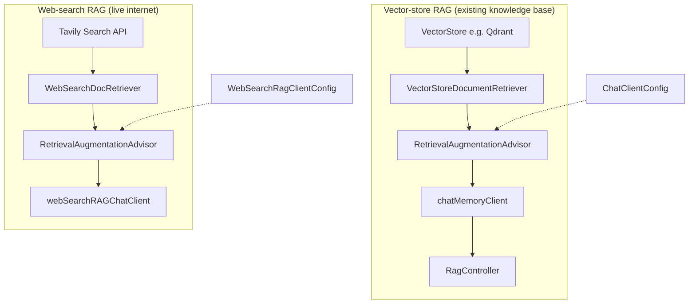
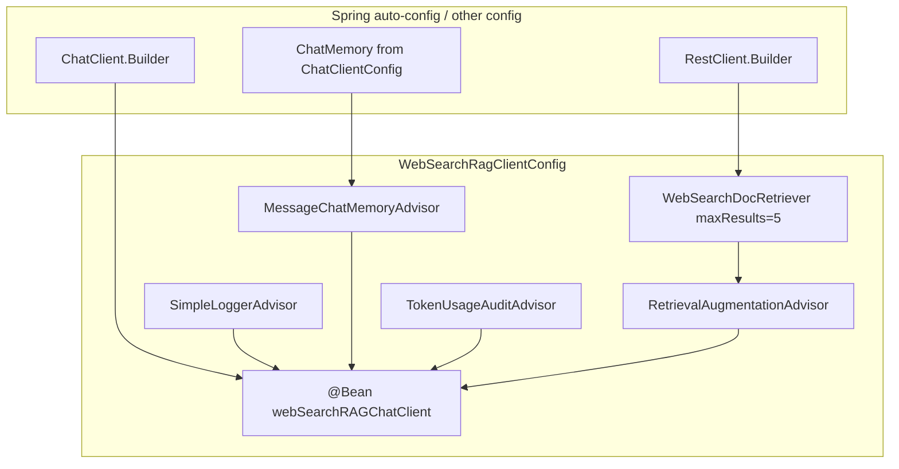
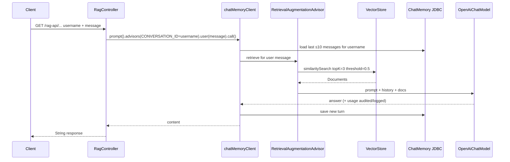

# Web Search RAG & Vector RAG — Class, Bean Flow, Why & Usage

Documents three related pieces:

| Class | Package | Role |
|---|---|---|
| `RagController` | `controller` | HTTP API for vector-store RAG chat |
| `WebSearchRagClientConfig` | `config` | Bean factory for **web-search** RAG `ChatClient` |
| `WebSearchDocRetriever` | `rag` | Custom `DocumentRetriever` over **Tavily** search API |

Also explains **why code was commented out in `RagController`** after retrieval moved into config advisors.

**Related:** `ChatClientConfig` (vector-store RAG on `chatMemoryClient`) — see `ChatClientConfig.md`.

---

## 1. Two RAG Styles in This App



| Style | Config class | Retriever | Client bean | Typical use |
|---|---|---|---|---|
| **Internal docs** | `ChatClientConfig` | `VectorStoreDocumentRetriever` | `chatMemoryClient` | HR policies, loaded PDFs, random seed data |
| **Live web** | `WebSearchRagClientConfig` | `WebSearchDocRetriever` | `webSearchRAGChatClient` | Current events, public web facts not in the vector DB |

Same Spring AI pattern in both: **`RetrievalAugmentationAdvisor` + a `DocumentRetriever`**. Only the *source* of documents changes.

---

## 2. Class: `WebSearchDocRetriever`

**File:** `rag/WebSearchDocRetriever.java`  
**Implements:** `org.springframework.ai.rag.retrieval.search.DocumentRetriever`

### 2.1 Why this class exists

Spring AI’s default RAG path uses a **vector store**. For answers grounded in the **live web**, you need a custom retriever that:

1. Takes the user `Query`
2. Calls an external search API (here: **Tavily**)
3. Maps hits into Spring AI `Document` objects (text + metadata + score)

`WebSearchDocRetriever` is that adapter. The rest of the stack (advisor → `ChatClient`) stays unchanged.

### 2.2 Design

```
Query.text()
    │
    ▼
POST https://api.tavily.com/search
  Authorization: Bearer $TAVILY_SEARCH_API_KEY
  body: { query, search_depth: "advanced", max_results: N }
    │
    ▼
TavilyResponsePayload.results[]
    │  map each Hit → Document
    ▼
List<Document>  (text=content, metadata title/url, score)
```

| Piece | Detail |
|---|---|
| API | Tavily `POST /search` |
| Auth | Env var `TAVILY_SEARCH_API_KEY` (required at construction) |
| HTTP client | `RestClient` from injected `RestClient.Builder` |
| Default `maxResults` | `5` |
| Search depth | `"advanced"` (fixed in request payload) |
| Builder | Fluent `WebSearchDocRetriever.builder().restClientBuilder(...).maxResults(n).build()` |

### 2.3 Bean flow involvement

`WebSearchDocRetriever` is **not** a `@Bean` itself. It is created **inline** inside `WebSearchRagClientConfig` when building the advisor:

```java
WebSearchDocRetriever.builder()
    .restClientBuilder(restClientBuilder)
    .maxResults(5)
    .build()
```

### 2.4 Usage

| Who uses it | How |
|---|---|
| `WebSearchRagClientConfig` | Passes instance as `.documentRetriever(...)` on `RetrievalAugmentationAdvisor` |
| Spring AI RAG pipeline | Advisor calls `retrieve(Query)` on every chat turn before the LLM call |

**Runtime requirement:** set environment variable:

```bash
TAVILY_SEARCH_API_KEY=your_key_here
```

If missing, construction fails with an assertion error.

### 2.5 Key methods

| Method | Purpose |
|---|---|
| `retrieve(Query)` | Call Tavily; return empty list if no hits |
| `builder()` | Construct with `RestClient.Builder` + result limit |
| `TavilyRequestPayload` / `TavilyResponsePayload` | JSON DTOs (request uses snake_case via `@JsonNaming`) |

---

## 3. Class: `WebSearchRagClientConfig`

**File:** `config/WebSearchRagClientConfig.java`  
**Type:** `@Configuration`

### 3.1 Why this class exists

`ChatClientConfig` already builds `chatMemoryClient` with **vector-store** RAG. Web search needs a **different document source** and therefore a **separate `ChatClient` bean**, so:

- Controllers can choose vector RAG vs web RAG by bean name
- Advisor stacks stay clear and do not mix retrievers
- Auto-configured `ChatClient.Builder` can still supply defaults/metrics

### 3.2 Bean produced

| Bean method | Bean name | Type | Dependencies |
|---|---|---|---|
| `chatClient(...)` | **`webSearchRAGChatClient`** | `ChatClient` | `ChatClient.Builder`, `ChatMemory`, `RestClient.Builder` |

### 3.3 Bean dependency graph



### 3.4 Default advisor stack (order of registration)

```
webSearchRAGChatClient
  defaultAdvisors:
    1. SimpleLoggerAdvisor          → log request/response
    2. MessageChatMemoryAdvisor     → multi-turn memory (needs CONVERSATION_ID)
    3. TokenUsageAuditAdvisor       → log token usage after call
    4. RetrievalAugmentationAdvisor → Tavily web search → inject docs
```

### 3.5 Design comparison vs `chatMemoryClient`

| Concern | `chatMemoryClient` (`ChatClientConfig`) | `webSearchRAGChatClient` (this config) |
|---|---|---|
| Model wiring | Explicit `OpenAiChatModel` | Auto-config `ChatClient.Builder` |
| Retriever | `VectorStoreDocumentRetriever` | `WebSearchDocRetriever` (Tavily) |
| topK / max results | `topK=3`, threshold `0.5` | `maxResults=5` (no vector threshold) |
| Memory | Shared `ChatMemory` bean | Same shared `ChatMemory` bean |
| Logging / audit | Yes | Yes |

### 3.6 Usage

Inject by name:

```java
public MyController(@Qualifier("webSearchRAGChatClient") ChatClient webSearchClient) {
    this.webSearchClient = webSearchClient;
}

// Example call
return webSearchClient.prompt()
    .advisors(a -> a.param(ChatMemory.CONVERSATION_ID, username))
    .user(message)
    .call()
    .content();
```

> **Note:** `RagController` currently uses **`chatMemoryClient`** (vector RAG), not `webSearchRAGChatClient`. Wire the web-search client when you add a “search the web” endpoint.

---

## 4. Class: `RagController`

**File:** `controller/RagController.java`  
**Type:** `@RestController` → base path `/rag-api`

### 4.1 Why this class exists

Exposes HTTP endpoints that answer user questions **using documents already embedded in the vector store**, with **per-user conversation memory**.

It is intentionally thin after the refactor: retrieval + prompt augmentation live in **config advisors**, not in the controller.

### 4.2 Injected beans

| Field | Source | Why |
|---|---|---|
| `chatMemoryClient` | `ChatClientConfig` | OpenAI client with logger, memory, token audit, **vector** `RetrievalAugmentationAdvisor` |
| `vectorStore` | Vector-store auto-config | **No longer used at runtime**; kept only as reference for the old manual RAG path (see commented code) |

### 4.3 Endpoints & usage

| HTTP | Path | System template (historical) | Behavior today |
|---|---|---|---|
| `GET` | `/rag-api/random-chat` | `systemPromptRandomDataTemplate.st` | RAG chat over random/seed vector data |
| `GET` | `/rag-api/document-chat` | `hrSystemPromptTemplatePdf.st` | RAG chat over HR PDF embeddings |

**Request contract:**

| Input | Where | Meaning |
|---|---|---|
| `username` | Header | `CONVERSATION_ID` for chat memory isolation |
| `message` | Query param | User question (also used as retrieval query by the advisor) |

**Example:**

```http
GET /rag-api/document-chat?message=What%20is%20the%20leave%20policy
username: alice
```

**Response:** plain string — model answer grounded in retrieved vector docs + prior turns for `alice`.

### 4.4 Current request flow (after config-based RAG)



### 4.5 What the controller still does

1. Map HTTP → username + message (+ optional template resource)
2. Set `CONVERSATION_ID` for memory
3. Call `chatMemoryClient` and return `.content()`

What it **no longer** does (moved to `ChatClientConfig`):

- Build `SearchRequest`
- Call `vectorStore.similaritySearch`
- Join document texts
- Inject `documents` into a system prompt template

---

## 5. Commented Code in `RagController` — Why It Was Disabled

### 5.1 Root cause

`ChatClientConfig` registers a **default** `RetrievalAugmentationAdvisor` on `chatMemoryClient`:

```java
// ChatClientConfig
RetrievalAugmentationAdvisor.builder()
    .documentRetriever(
        VectorStoreDocumentRetriever.builder()
            .vectorStore(vectorStore)
            .topK(3)
            .similarityThreshold(0.5)
            .build())
    .build();
```

That advisor **replaces** the controller’s old manual RAG steps. Leaving both active would **duplicate** retrieval and context injection.

### 5.2 What was commented (and what replaced it)

| Commented block (controller) | Replaced by (config) |
|---|---|
| `SearchRequest.builder().query(message).topK(3).similarityThreshold(0.5)` | `VectorStoreDocumentRetriever` with same topK / threshold |
| `vectorStore.similaritySearch(searchRequest)` | Advisor calls retriever on each `.call()` |
| `similarDocs.stream().map(Document::getText).collect(joining)` | Advisor injects documents into the prompt pipeline |
| `.system(template.param("documents", similarContext))` | Automatic RAG context; no manual template param required for retrieval |

### 5.3 Learning reference (old vs new)

**Old (manual, controller-owned RAG):**

```text
Controller
  → VectorStore.similaritySearch
  → build similarContext string
  → ChatClient.prompt().system(template, documents=similarContext).user(msg).call()
```

**New (advisor-owned RAG):**

```text
Controller
  → ChatClient.prompt().advisors(CONVERSATION_ID).user(msg).call()
       ↑
  ChatClientConfig default advisors already include RetrievalAugmentationAdvisor
```

### 5.4 Why keep the comments

- Teaching artifact: shows the pre-advisor style side-by-side with the new style
- Documents intentional removal, not accidental dead code
- Makes it obvious that **re-enabling both** would double-fetch context

### 5.5 `vectorStore` field & `systemPromptTemplate` parameter

| Symbol | Status | Reason |
|---|---|---|
| `vectorStore` field | Injected but unused at runtime | Required only by the commented manual path; kept for reference |
| `systemPromptTemplate` arg | Still passed from endpoints | Historical; `.system(template + documents)` is commented. Re-enable only if you need custom system wording *beyond* advisor RAG |

---

## 6. End-to-End Design Summary

```
┌─────────────────────────────────────────────────────────────────┐
│                         HTTP layer                              │
│  RagController  /rag-api/random-chat | document-chat            │
│  → chatMemoryClient (vector RAG)                                │
│  (future) → webSearchRAGChatClient (web RAG)                    │
└────────────────────────────┬────────────────────────────────────┘
                             │
         ┌───────────────────┴───────────────────┐
         ▼                                       ▼
 ChatClientConfig                      WebSearchRagClientConfig
  chatMemoryClient                      webSearchRAGChatClient
  advisors:                             advisors:
    logger, memory, audit,                logger, memory, audit,
    RetrievalAugmentationAdvisor          RetrievalAugmentationAdvisor
         │                                       │
         ▼                                       ▼
 VectorStoreDocumentRetriever            WebSearchDocRetriever
  topK=3, threshold=0.5                   Tavily API, maxResults=5
         │                                       │
         ▼                                       ▼
    VectorStore (Qdrant, …)              api.tavily.com/search
```

### Why advisors instead of controller logic?

| Benefit | Explanation |
|---|---|
| **DRY** | One retrieval policy shared by every endpoint using that client |
| **Thin controllers** | HTTP only: params, conversation id, return content |
| **Swappable sources** | Change retriever in config without touching controllers |
| **Consistent pipeline** | Logging, memory, audit, and RAG always run together |
| **Testability** | Retriever / advisor beans can be unit-tested in isolation |

---

## 7. Quick Usage Cheatsheet

### Vector RAG (current `RagController`)

```bash
curl -H "username: alice" \
  "http://localhost:8080/rag-api/document-chat?message=What%20is%20PTO%20policy"
```

Requires: vector store populated (e.g. `HRPolicyLoader` / `RandomDataLoader`), `chatMemoryClient` from `ChatClientConfig`.

### Web-search RAG (client bean ready)

```java
@Qualifier("webSearchRAGChatClient") ChatClient client;

client.prompt()
  .advisors(a -> a.param(CONVERSATION_ID, userId))
  .user("What happened in AI news today?")
  .call()
  .content();
```

Requires: `TAVILY_SEARCH_API_KEY` in the environment.

---

## 8. Related Files

| File | Relation |
|---|---|
| `config/ChatClientConfig.java` | Defines `chatMemoryClient` + vector `RetrievalAugmentationAdvisor` (reason controller code is commented) |
| `ChatClientConfig.md` | Full design of all chat client beans |
| `advisors/TokenUsageAuditAdvisor.java` | Shared by both RAG clients |
| `rag/HRPolicyLoader.java` / `RandomDataLoader.java` | Load data into `VectorStore` for vector RAG |
| `resources/promtTemplates/*.st` | Former system templates for manual document injection |
