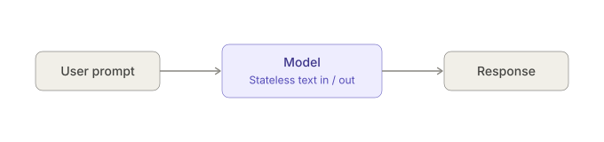
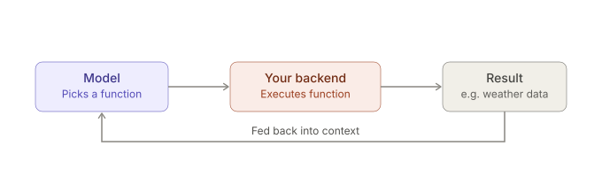
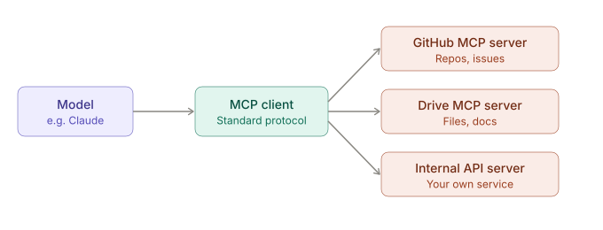

Here's a quick breakdown of these LLM application patterns — likely what you meant is **RAG vs Agents vs Tools** (and maybe "Advisor" is a typo, but I'll cover that too as a bonus):

## RAG (Retrieval-Augmented Generation)
- **What**: Fetch relevant documents/chunks from a vector DB or search index, inject them into the prompt as context, then let the LLM generate an answer grounded in that context.
- **Use case**: Q&A over private docs, knowledge bases, reducing hallucination.
- **Key idea**: The model doesn't "do" anything — it just reads more before answering.

## Tools (Function Calling)
- **What**: The LLM is given a set of callable functions (with schemas). It decides *which* function to call and with *what arguments*, based on the user's request. The actual execution happens outside the model (your backend code).
- **Use case**: "What's the weather in Chennai?" → LLM calls `get_weather(lat, lon)` → your code runs it → result fed back to LLM → final answer.
- **Key idea**: The model reasons about *what action to take*, but doesn't execute it itself.

## Agents
- **What**: A loop where the LLM can call tools, observe results, and decide the *next* step — repeatedly, until it decides the task is done. Often combines RAG + Tools + memory + planning.
- **Use case**: Multi-step tasks like "book me a flight and email the itinerary" — requires chaining several tool calls with reasoning in between.
- **Key idea**: Autonomy over a sequence of actions, not just a single response.

## "Advisor" pattern (if you meant this)
Not a standard industry term, but sometimes used informally for an LLM that gives recommendations/guidance *without* taking action — e.g., a code review advisor that suggests changes but doesn't apply them. It's essentially RAG or plain prompting without tool execution.

## Quick comparison table

| Aspect | RAG | Tools | Agents |
|---|---|---|---|
| Model's job | Read + answer | Pick + call one function | Plan + loop over multiple calls |
| Execution | None (just retrieval) | Single external call | Multiple external calls |
| State/memory | Usually stateless per query | Stateless per call | Often stateful across steps |
| Complexity | Low-Medium | Medium | High |
| Example | Chatbot over your GCP docs | "Get current CPU usage" | "Diagnose and fix a failing pod" |

If you're prepping for interviews, the sharpest way to phrase it: **RAG solves the knowledge gap, Tools solve the action gap, Agents solve the multi-step reasoning + action gap.**

Want me to tie this to something concrete — like how you'd design a RAG or agent-based system for one of your Java/GCP microservices?

---

Continuing the same ecosystem — here's where **Model** and **MCP** fit, plus other terms worth knowing for interviews:

## Model (LLM)
- **What**: The core neural network (e.g., Claude, GPT, Llama) that takes text in, predicts text out. It has no memory, no ability to act — it's pure inference on a given context window.
- **Key idea**: Everything else (RAG, Tools, Agents, MCP) exists to work *around* the model's limitations — no real-time data, no memory, no ability to act in the world.

## MCP (Model Context Protocol)
- **What**: An open standard (from Anthropic) that defines how LLM applications connect to external data sources and tools in a uniform way — instead of every app writing custom integration code per tool/service.
- **Analogy**: Think of it like a "USB-C for AI tools" — a standard interface so any MCP-compatible client (like Claude Desktop) can plug into any MCP server (Google Drive, GitHub, a database, etc.) without bespoke glue code.
- **Relation to Tools**: MCP is essentially a *standardized transport + schema* for exposing tools/resources to a model — so it overlaps with "Tools" but solves the integration/interoperability problem specifically.
- **Use case**: You expose your company's internal APIs as an MCP server once, and any MCP-aware LLM client can use them — no per-app custom function-calling code.

## Other related terms worth knowing

| Term | What it is |
|---|---|
| **Embeddings** | Vector representations of text used for similarity search (the backbone of RAG retrieval) |
| **Vector DB** | Database optimized for storing/querying embeddings (e.g., Pinecone, Weaviate, pgvector) |
| **Context window** | The max tokens a model can "see" at once (prompt + history + retrieved docs) |
| **System prompt** | Instructions given to the model before user input, shaping behavior/persona |
| **Fine-tuning** | Retraining a model's weights on custom data (changes the model itself, unlike RAG which just adds context) |
| **Prompt engineering** | Crafting inputs to get better outputs, without touching the model or adding tools |
| **Orchestration framework** | Libraries like LangChain/LlamaIndex that wire together RAG + Tools + Agents + memory |
| **Guardrails / evals** | Systems to check/validate model output for safety, correctness, format |

## Updated mental model

```
Model        → the brain (pure text in/out, stateless)
RAG          → gives it a library card (external knowledge)
Tools        → gives it hands (can call specific functions)
MCP          → standardizes how those hands plug into things (protocol, not a new capability)
Agents       → gives it a to-do list + loop (multi-step planning & execution)
```

For an interview, a crisp line: **"MCP isn't a competing concept to RAG/Tools/Agents — it's the plumbing standard that makes exposing tools and data sources to models interoperable, rather than every integration being custom-built."**

Want a concrete example — like how you'd stand up an MCP server for one of your GCP microservices so Claude (or another LLM client) could query it directly?

---

Here are five diagrams walking through the stack, from simplest to most complex.

**1. Model** — the base unit everything else builds on. Pure text in, text out, no memory, no actions.



**2. RAG** — the model is given relevant context before it answers, pulled from your own data.



**3. Tools** — the model decides *what* to call; your code executes it and feeds the result back.



**4. MCP** — the standard "plug" that connects a model client to many external tool/data servers without custom glue code per integration.



**5. Agents** — the model loops: act, observe, decide the next step, repeat until the task is done.



That covers the full stack visually: **Model** (stateless brain) → **RAG** (add knowledge before answering) → **Tools** (single function call, one round trip) → **MCP** (the standard plug connecting a client to many tool/data servers) → **Agents** (the loop that plans, acts, observes, and repeats until done, usually using tools/MCP under the hood).

If you want, I can go one step further and draw how these compose in a single real system — e.g. an agent using RAG for context and MCP-exposed tools for actions.